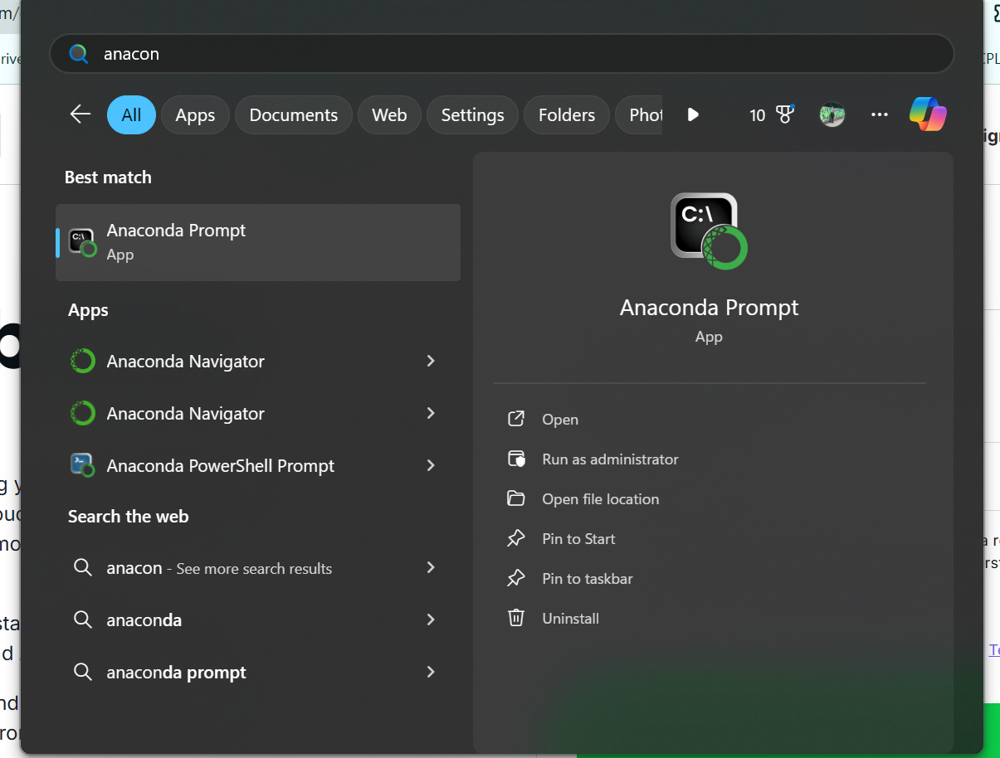
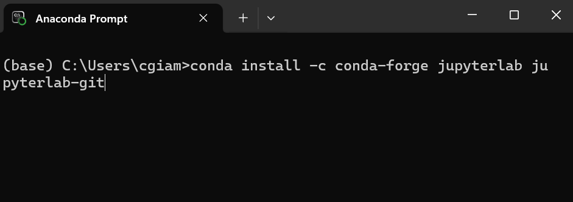
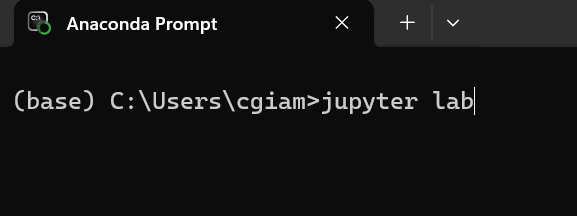
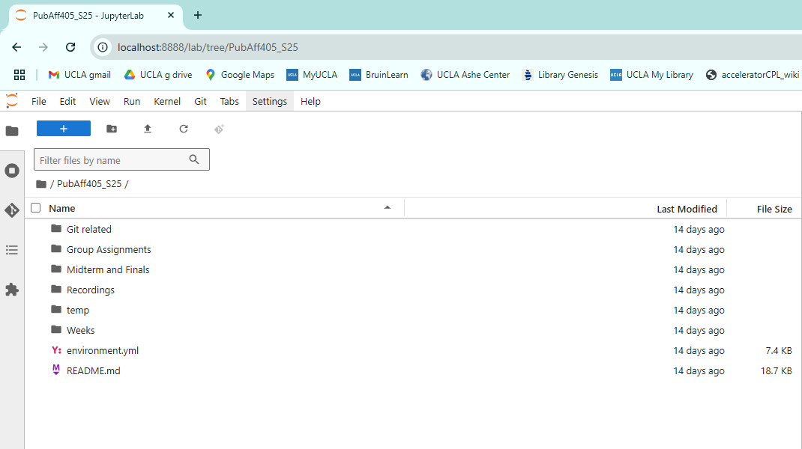
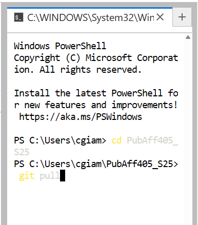

# Installing anaconda, github and jupyter lab (Windows)

Before we start class, you will need to install Anaconda, Git, and Jupyter Lab. Anaconda is a user-friendly python environment that allows you to run jupyter notebooks and publish your work throughout the quarter to GitHub via the [git extension](https://github.com/jupyterlab/jupyterlab-git). 

* Install [Anaconda](https://www.anaconda.com/download). You can sign up for free.

* In your search bar, type in `anaconda prompt`. 

<kbd></kbd>

* Next, install the git extension via these two methods [#1](https://github.com/jupyterlab/jupyterlab-git?tab=readme-ov-file#install) or [#2](https://anaconda.org/conda-forge/jupyterlab-git). Both work! Type on the `conda install` command to the anaconda prompt, hit enter, select Y. 

<kbd></kbd>

* Anaconda should have jupyter lab installed by default. To start `jupyter lab` after installing the `git extension` type `jupyter lab` and hit enter. A local internet browser will open. 

<kbd></kbd>

<kbd></kbd>

# Installing anaconda, github and jupyter lab (Mac)

Before we start class, you will need to install Anaconda, Git, and Jupyter Lab. Anaconda is a user-friendly python environment that allows you to run jupyter notebooks and publish your work throughout the quarter to GitHub via the [git extension](https://github.com/jupyterlab/jupyterlab-git). 

* Install [Anaconda](https://www.anaconda.com/download). You can sign up for free.

* Follow this [tutorial](https://support.apple.com/guide/terminal/open-or-quit-terminal-apd5265185d-f365-44cb-8b09-71a064a42125/mac) to open up the Terminal app on your Mac. 

* Next, install the git extension via these two methods [#1](https://github.com/jupyterlab/jupyterlab-git?tab=readme-ov-file#install) or [#2](https://anaconda.org/conda-forge/jupyterlab-git). Both work! Type the `conda install` command to the anaconda prompt, hit enter, select Y. 

* With your Terminal open, type `conda install -c conda-forge jupyterlab jupyterlab-git`. Hit Return. 

* Anaconda should have jupyter lab installed by default. To start `jupyter lab` after installing the `git extension` type `jupyter lab` and hit enter. A local internet browser will open. 

* If you get an error message that the git extension is not working, please note the window that pops up is asking you to install the required tools to run Git. You will click install, refresh your jupyter lab environment on your web browser, and Git should be working on jupyter lab. 

# Getting started each week (Windows and Mac)
At the start of each week, you will be asked to update the class repository. Note that this is different from your own personaly repository. To do so, follow these instructions. Please note that the screenshots below are from my PC with Windows OS. The relative logic applies on a Mac when running `jupyter lab` from the Conda or Terminal prompt. 

First, we will clone the course repository and then run a "pull" each week to download the latest course material into JupyterLab.

* Install the [GitHub extension for Jupyter Lab in the Anaconda terminal](https://github.com/jupyterlab/jupyterlab-git?tab=readme-ov-file#install)
<kbd></kbd>

* After installing the Git extension, type into the terminal `jupyter lab` to start a local notebook.

* Copy the course GitHub clone HTTPS link.

<kbd></kbd>

* Paste the course GitHub clone HTTPS link --> Git --> Clone a Repository --> Paste link --> Clone

<kbd></kbd> 

Note that the link above (git puller) follows the [following set of rules](https://jupyterhub.github.io/nbgitpuller/topic/automatic-merging.html#topic-automanbltic-merging).

* We will change the directory via the `cd` command and copy the path to the course repository. Then, we will run `git pull` to download weekly course updates. 

<kbd></kbd> 

* We will run `jupyter lab` each week, open a `Terminal` window from our local lab, switch to the course folder and run `git pull`. 

